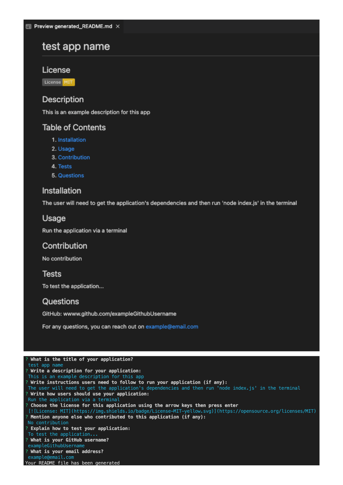

# readme-generator
Last updated on: 21st Feb 2023. Last updated by: Shohidul Shah Hoque

## Description
This application is intended to be deployed via a terminal where the user will be presented with a series of prompts which will serve to populate a README file that the user can use for their new application.

The prompts the user will respond to will be in relation to the following sections:
- Application title 
- Description 
- Installation 
- Usage 
- License 
- Contribution 
- Tests 
- Other questions
    - Github username
    - Email address

The benefits of this application
- The user does not need to remember what makes up a good README file
- Using a template will improve the user's ability to write a professional README

## Installation
The user should follow these steps to be able to run the application:
1. Download Node.js to their computer if it's not already installed
2. In the terminal, go to the directory path where the folder in question resides
3. Type 'npm install' in the terminal to download the applications dependencies
4. Type 'node index.js' in the terminal to initiate the application

For continued use, only step 4 is required which will overwrite the generated README file

## Usage
The application can only be used on a computer that has a command-line interface

## Application deployed

## Credits
Author: Shohidul Shah Hoque